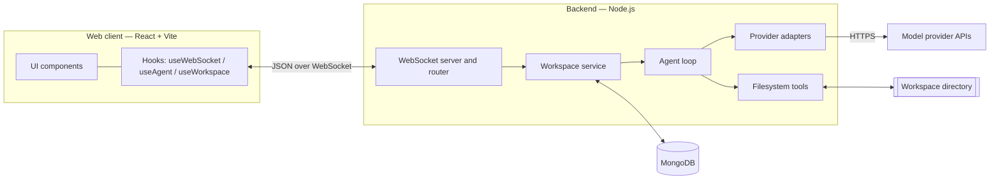
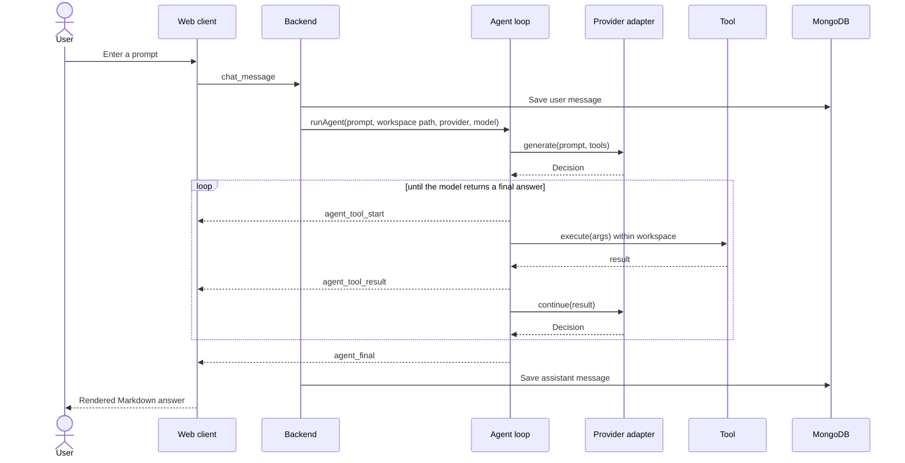
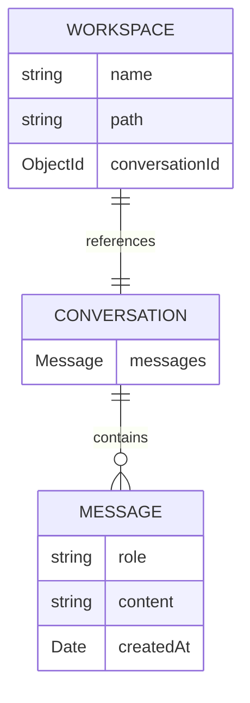

# Relay

**Relay** is a full-stack AI coding agent. You point it at a project directory, pick a model, and ask it — in plain language — to explore, explain, edit, or build. The agent inspects and modifies real files through a sandboxed toolset, and every step it takes streams back to the browser live before the final answer is rendered.

It is provider-agnostic: the same agent loop runs against **Google Gemini**, **Anthropic Claude**, or **OpenAI**, selectable per message.


---

## What it does

- **Conversational coding over a real directory.** The agent reads, writes, edits, lists, and searches files inside a workspace you designate.
- **Live tool streaming.** Each tool call and result is pushed to the UI as it happens — you see *Reading file…*, *Editing file…*, then the answer.
- **Multi-provider.** Choose Gemini, Claude, or OpenAI per message; all three sit behind one uniform interface.
- **Persistent workspaces & history.** Workspaces and conversations are stored in MongoDB.
- **Sandboxed by construction.** Every filesystem path is confined to the workspace root; traversal outside it is rejected.

---

## Repository layout

```
AI-factory/
├── backend/     Node.js + TypeScript WebSocket service, agent loop, tools, DB   →  backend/README.md
├── frontend/    React + Vite web client (Relay UI)                              →  frontend/README.md
└── README.md    You are here
```

Each package has its own README with the deep, technical detail. This document covers the system as a whole and how to run it.

---

## System architecture



The frontend is a reactive shell: all of its state is derived from messages on a single WebSocket. The backend is transport-thin — no REST — and keeps a clean separation between routing, persistence, the provider-neutral agent core, and the sandboxed tools.

### How a prompt is answered



The loop is provider-neutral. Each adapter translates a provider's native tool-calling format into a shared `Decision` (`tool_call` or `final`) and maintains its own conversation history in that provider's expected shape.

### Data model



Creating a workspace also creates its conversation. A conversation embeds an ordered list of `user`/`assistant` messages. Intermediate tool activity is streamed to the client but not stored.

---

## Technology

| Layer | Technologies |
| --- | --- |
| Frontend | React 19, TypeScript, Vite 8, Tailwind CSS v4, `react-markdown` + `rehype-highlight` |
| Transport | Native WebSocket (`ws` on the server), JSON message protocol |
| Backend | Node.js, TypeScript, `ws`, Mongoose |
| AI providers | `@google/genai`, `@anthropic-ai/sdk`, `openai` |
| Storage | MongoDB |

---

## Developer guide

### Prerequisites

- **Node.js 18+** and npm
- **MongoDB** — a local instance or a hosted URI (e.g. MongoDB Atlas)
- At least one **model provider API key** (Gemini, Anthropic, and/or OpenAI)

### 1. Clone

```bash
git clone https://github.com/akashbisht004/Relay.git
cd Relay
```

### 2. Configure and start the backend

```bash
cd backend
npm install
```

Create `backend/.env`:

```env
# Database (required)
MONGO_URL=mongodb://localhost:27017/relay

# Provider keys — supply the ones you plan to use
GEMINI_API_KEY=your_gemini_key
ANTHROPIC_API_KEY=your_anthropic_key
OPENAI_API_KEY=your_openai_key
```

```bash
npm run dev
```

The WebSocket server starts on **port 3000** (hardcoded) and connects to MongoDB. If `MONGO_URL` is missing, the process exits — that's the first thing to check if it won't start.

### 3. Start the frontend

In a second terminal:

```bash
cd frontend
npm install
npm run dev
```

Open the Vite URL (default **http://localhost:5173**). The header status pill turns green (*Connected*) once it reaches the backend. The client expects the backend at `ws://localhost:3000`; if you change the backend port, update the URL in `frontend/src/hooks/useWebSocket.tsx`.

### 4. Use it

1. **Create a workspace** — click **+** in the sidebar, give it a name and the **absolute path** to a project directory on the machine running the backend, and save.
2. **Select** the workspace. Its conversation history loads.
3. **Pick a provider and model** in the composer, type a request (e.g. *"List the files in src and summarize what this project does"*), and send.
4. **Watch** the tool calls stream in, then read the rendered answer. Follow up in the same thread.

> **Safety:** the agent can create, overwrite, and edit files anywhere under the workspace path. Point workspaces only at directories you're comfortable letting it change, and prefer version-controlled projects so edits are reviewable. Path traversal outside the workspace root is blocked, but writes *within* it are real.

### Common scripts

**Backend** (`backend/`)

| Command | Does |
| --- | --- |
| `npm run dev` | Watch mode via `tsx` |
| `npm run build` | Compile TypeScript to `dist/` |
| `npm start` | Run the compiled server |

**Frontend** (`frontend/`)

| Command | Does |
| --- | --- |
| `npm run dev` | Vite dev server (HMR) |
| `npm run build` | Type-check + production bundle |
| `npm run preview` | Serve the production build |
| `npm run lint` | ESLint |

---

See the package READMEs ([backend](backend/README.md), [frontend](frontend/README.md)) for the reasoning and for where to change them.
