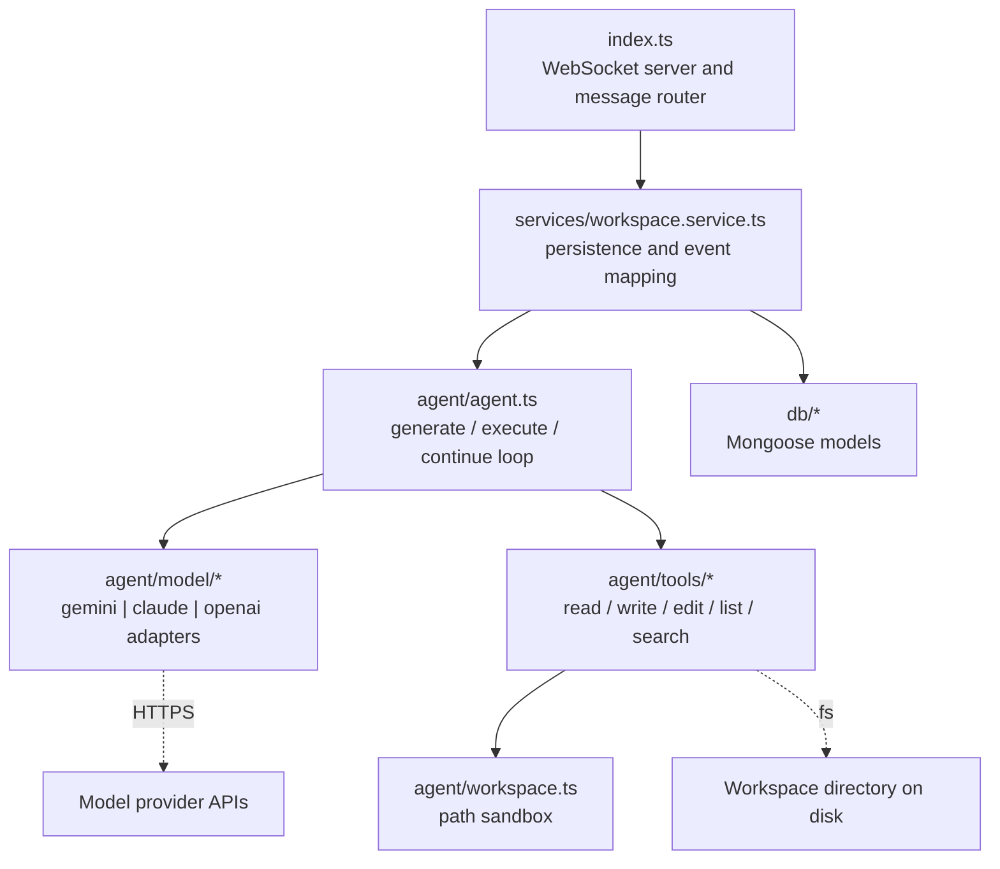
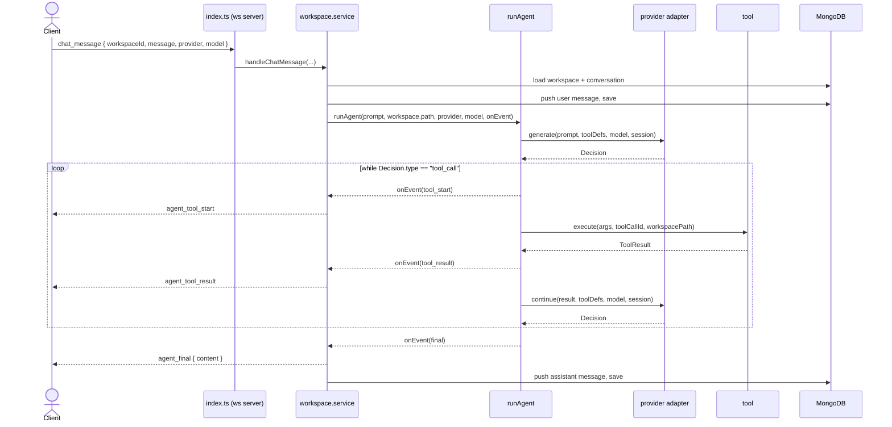
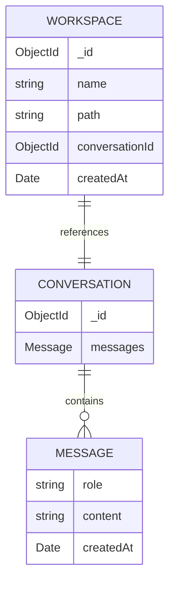

# Relay — Backend

The backend is a **Node.js + TypeScript WebSocket service** that powers Relay's AI coding agent. It accepts prompts over a WebSocket, drives a provider-agnostic **generate → tool → continue** agent loop against a real project directory, streams every tool call back to the client as it happens, and persists workspaces and conversation history in MongoDB.

It is deliberately transport-thin: there is no REST layer. A single WebSocket connection carries a small, typed message protocol in both directions.

---

## Responsibilities

| Concern | Where it lives |
| --- | --- |
| Accept connections, parse and route messages | `src/index.ts` |
| Persist workspaces / conversations, map agent events to wire messages | `src/services/workspace.service.ts` |
| Run the agent loop (generate, execute tools, continue) | `src/agent/agent.ts` |
| Talk to model providers behind one interface | `src/agent/model/*` |
| Perform sandboxed filesystem operations | `src/agent/tools/*` + `src/agent/workspace.ts` |
| Store data | `src/db/*` (Mongoose) |
| Shared wire + domain types | `src/types/*`, `src/agent/types.ts` |

---

## Architecture



**Layering rule:** `index.ts` only routes; it never touches the database or the agent directly. `workspace.service.ts` is the only layer that knows about both persistence and the agent, and it is where agent events are translated into client-facing messages. The agent core (`agent/`) has no knowledge of WebSockets or Mongo — it receives a prompt, a workspace path, and an optional `onEvent` callback.

---

## Request lifecycle

A `chat_message` is the interesting path. Everything is streamed over the same socket.



Two persistence points bracket the run: the user message is saved **before** the agent starts, and the assistant's final message is appended when the loop resolves. Intermediate tool traffic is streamed but **not** persisted — reloading a conversation shows the messages, not the tool steps.

---

## WebSocket protocol

The server listens on **port `3000` (hardcoded in `index.ts`)**. All frames are JSON. Types are the source of truth in [`src/types/websocket.ts`](src/types/websocket.ts).

### Client → Server (`ClientMessage`)

| `type` | Payload | Effect |
| --- | --- | --- |
| `create_workspace` | `workspaceDetails: { name, path }` | Creates a `Conversation`, then a `Workspace` pointing at it. Replies `workspace_created`. |
| `get_workspaces` | — | Returns all workspaces as `workspaces`. |
| `chat_message` | `workspaceId, message, provider, model` | Runs the agent; streams `agent_tool_start` / `agent_tool_result`, then `agent_final`. |
| `get_conversation` | `conversationId` | Returns a single conversation as `conversation`. |

> Note: the `chat_message` type also declares `conversationId`, but the handler resolves the conversation from `workspaceId → workspace.conversationId`, so that field is currently ignored.

### Server → Client (`ServerMessage`)

| `type` | Payload |
| --- | --- |
| `workspace_created` | `workspace` |
| `workspaces` | `workspaces[]` |
| `conversation` | `conversation` |
| `agent_tool_start` | `tool, toolCallId, args` |
| `agent_tool_result` | `tool, toolCallId, success, data?, error?` |
| `agent_final` | `content` |
| `error` | `message` |

Any thrown error inside the message handler is caught and collapsed into `{ type: "error", message: "Something went wrong" }` — the connection stays open.

---

## The agent loop

`runAgent(userPrompt, workspacePath, provider, model, onEvent?)` in [`src/agent/agent.ts`](src/agent/agent.ts) is a synchronous-looking loop over an async decision stream:

1. Build tool definitions via `getToolDefinitions()` and an empty `ModelSession` (`{ history: [] }`).
2. Resolve the adapter: `sdk = models[provider]` — throws on an unknown provider.
3. `decision = await sdk.generate(...)`.
4. **Loop:**
   - `tool_call` → look up the tool in the `tools` Map (throws if missing), emit `tool_start`, `await tool.execute(args, toolCallId, workspacePath)`, emit `tool_result`, then `sdk.continue(result, ...)` to get the next decision.
   - `final` → emit `final` and return.

The loop itself is provider-neutral. Each adapter is responsible for turning provider-native responses into a `Decision` and for accumulating provider-native turns onto `session.history`.

### Decision and result shapes

From [`src/agent/types.ts`](src/agent/types.ts):

```ts
type Decision =
  | { type: "tool_call"; toolCallId: string; tool: string; args: Record<string, unknown> }
  | { type: "final"; content: string };

type ToolResult = {
  success: boolean;
  toolCallId: string;
  tool: string;
  data?: unknown;
  error?: string;
};
```

---

## Model provider abstraction

Every provider implements the same two-method `Model` interface ([`src/agent/model/types.ts`](src/agent/model/types.ts)):

```ts
type Model = {
  generate:  (userPrompt: string, tools: ToolDefinition[], model: string, session: ModelSession) => Promise<Decision>;
  continue:  (toolResult: ToolResult, tools: ToolDefinition[], model: string, session: ModelSession) => Promise<Decision>;
};
```

Adapters are registered in [`src/agent/model/index.ts`](src/agent/model/index.ts):

```ts
export const models: Record<ModelProvider, Model> = { gemini, claude, openai };
```

`ModelSession.history` is typed `unknown[]` on purpose: each adapter stores turns in **its own provider-native format** and owns the translation to/from `Decision`.

| Adapter | SDK | Call shape | History accumulation |
| --- | --- | --- | --- |
| `gemini.ts` | `@google/genai` | `ai.models.generateContent` with `systemInstruction` + `tools: [{ functionDeclarations }]` | pushes model `content`; continue pushes a `functionResponse` part |
| `claude.ts` | `@anthropic-ai/sdk` | `anthropic.messages.create({ model, max_tokens, system, tools, messages })` | pushes the full assistant message (preserving `tool_use` blocks); continue pushes a user `tool_result` block |
| `openai.ts` | `openai` | `openai.responses.create({ model, instructions, input, tools })` | spreads `response.output`; continue pushes a `function_call_output` item |

All three share one system prompt from [`src/agent/systemPrompt.ts`](src/agent/systemPrompt.ts).

### Adding a provider

1. Implement `generate` and `continue` in `src/agent/model/<name>.ts`, translating that SDK's tool-call representation into a `Decision`.
2. Add the provider to the `ModelProvider` union in `model/types.ts`.
3. Register it in `model/index.ts`.
4. Expose its models in the frontend model picker.

---

## Tools

Tools are the agent's only way to touch the world. Each is a `Tool` ([`src/agent/tools/types.ts`](src/agent/tools/types.ts)) with a name, description, a JSON-Schema `parameters` object, and an `async execute(args, toolCallId, workspacePath)` that returns a `ToolResult`. They are collected into a `Map` in [`src/agent/tools/index.ts`](src/agent/tools/index.ts); `getToolDefinitions()` strips the executors and normalizes `required` for the model.

| Tool | Parameters | Behavior |
| --- | --- | --- |
| `read_file` | `path` | Reads a UTF-8 file inside the workspace. |
| `write_file` | `path`, `content` | Writes complete content, creating/overwriting the file. |
| `edit_file` | `path`, `oldText`, `newText` | Reads the file, fails if `oldText` is absent, else replaces the **first** occurrence and writes back. |
| `list_directory` | `path` | Lists entries as `{ name, type: "file" \| "directory" }`. Use `"."` for the root. |
| `search_files` | `query`, `path` | Recursively greps file contents for a substring; skips `node_modules`, `.git`, and `dist`, and ignores files that don't decode as UTF-8. |

Every tool validates argument types at runtime and returns a structured error (`success: false`) rather than throwing, so a bad call becomes a `tool_result` the model can react to instead of aborting the loop.

### Workspace sandboxing

All paths pass through `resolveWorkspacePath(workspacePath, filePath)` ([`src/agent/workspace.ts`](src/agent/workspace.ts)):

```ts
const absolutePath = path.resolve(workspacePath, filePath);
const relativePath = path.relative(workspacePath, absolutePath);
if (relativePath.startsWith("..") || path.isAbsolute(relativePath)) {
  throw new Error(`Path "${filePath}" is outside the workspace`);
}
```

This rejects `../` traversal and absolute paths, confining every read and write to the workspace root. It is the backend's primary safety boundary — the agent is otherwise free to modify files, so **only point a workspace at a directory you trust the agent to change.**

### Adding a tool

1. Create `src/agent/tools/<name>.ts` exporting a `Tool` (validate args, resolve paths via `resolveWorkspacePath`, return a `ToolResult`).
2. Register it in the `tools` Map in `tools/index.ts`. It is now advertised to every provider automatically.

---

## Persistence

Mongoose models live in [`src/db/model.ts`](src/db/model.ts); the connection is opened by `connectDB()` in [`src/db/connector.ts`](src/db/connector.ts) using `process.env.MONGO_URL` (throws if unset).



`messages` is an embedded subdocument array on the conversation; `role` is constrained to `"user" | "assistant"`.

---

## Configuration

`dotenv` is loaded at startup (`configDotenv()` in `index.ts`, plus `import "dotenv/config"` in the agent and adapters). Create `backend/.env`:

```env
# Database (required — the process exits if missing)
MONGO_URL=mongodb://localhost:27017/relay

# Provider API keys — only the ones you actually use are required
GEMINI_API_KEY=your_gemini_key
ANTHROPIC_API_KEY=your_anthropic_key
OPENAI_API_KEY=your_openai_key
```

| Variable | Used by | Required |
| --- | --- | --- |
| `MONGO_URL` | `db/connector.ts` | Yes |
| `GEMINI_API_KEY` | `model/gemini.ts` | When using the Gemini provider |
| `ANTHROPIC_API_KEY` | `model/claude.ts` | When using the Claude provider |
| `OPENAI_API_KEY` | `model/openai.ts` | When using the OpenAI provider |

> The listen port is **not** configurable via env — it is hardcoded to `3000`. There is also no `PORT` variable despite what older docs implied.

---

## Running

```bash
npm install
npm run dev     # tsx watch src/index.ts — reloads on change
```

| Script | Command | Purpose |
| --- | --- | --- |
| `dev` | `tsx watch src/index.ts` | Development with hot reload |
| `build` | `tsc` | Type-check and emit to `dist/` |
| `start` | `node dist/index.js` | Run the compiled build |

**Stack:** Node.js, TypeScript (`NodeNext`, `strict`, CommonJS output), `ws`, Mongoose, and the `@google/genai` / `@anthropic-ai/sdk` / `openai` SDKs. `zod` is a listed dependency but is not currently wired into request or tool validation — validation today is hand-written runtime type guards inside each tool.

---

## Known constraints

- **Port `3000` is hardcoded**; change it in `index.ts` if needed.
- **No auth and no connection isolation** — any client on the socket can create workspaces pointed at any server-readable path. Intended for local/trusted use.
- **Sessions are per-request.** `runAgent` starts each call with an empty `history`, so the model does not see prior turns in the conversation — only the current prompt. Persisted messages are for the UI, not fed back as context.
- **`agent_tool_*` events are streamed but not stored**; only user and assistant messages persist.
