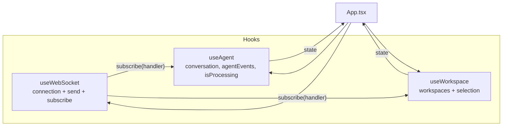
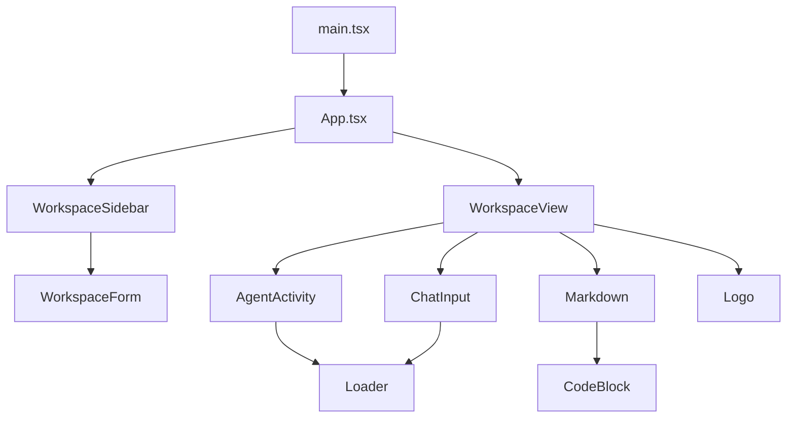
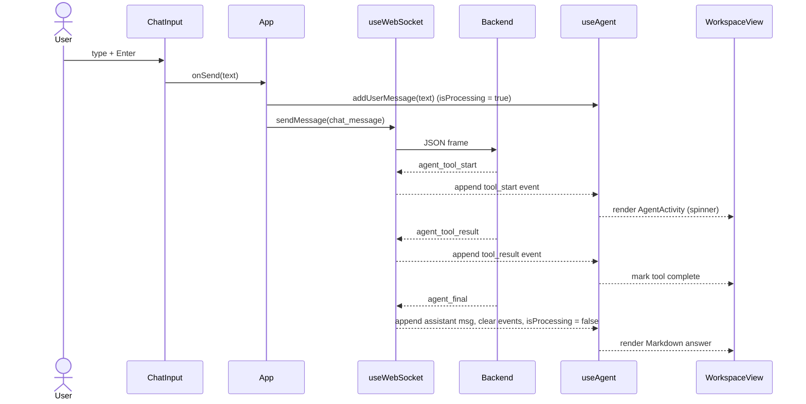

# Relay — Web Client

The Relay web client is a **React 19 + TypeScript + Vite** single-page app. It is the operator console for the AI coding agent: pick a workspace, choose a provider/model, send a prompt, and watch the agent's tool calls stream in live before the final answer is rendered as Markdown.

It holds no business logic of its own — it is a thin, reactive shell over a single WebSocket connection to the backend. All state derives from messages that arrive on that socket.

---

## Stack

| Area | Choice |
| --- | --- |
| Framework | React 19 (`StrictMode`, function components + hooks) |
| Language | TypeScript (`strict`, `verbatimModuleSyntax`, `noUnusedLocals`) |
| Build | Vite 8 (`@vitejs/plugin-react`) |
| Styling | Tailwind CSS v4 via `@tailwindcss/vite` (no `tailwind.config.js`; utilities imported from `index.css`) |
| Transport | Native `WebSocket` — no client library |
| Markdown | `react-markdown` + `remark-gfm` + `rehype-highlight` (+ `highlight.js` `github-dark` theme) |

---

## Architecture

State is owned by three hooks that all share **one** WebSocket connection. `useWebSocket` exposes a `subscribe(handler)` pub/sub; the other hooks register handlers and project the relevant server messages into React state. `App` wires them together and passes state down; it holds no socket logic itself.



### Component tree



---

## State & message flow

A round trip, from keystroke to rendered answer:



`isProcessing` is the single source of truth for "the agent is working": it is set `true` in `addUserMessage` and cleared on `agent_final`, `error`, or a fresh `conversation`. It drives the thinking indicator, the send-button spinner, and input disabling — all from one flag.

---

## Directory layout

```
frontend/src/
├── main.tsx                  # React root (StrictMode)
├── App.tsx                   # Shell: header, sidebar, workspace view; owns model selection + sidebar state
├── index.css                 # Tailwind import + Relay keyframes (thinking dots, shimmer, reduced-motion)
├── hooks/
│   ├── useWebSocket.tsx       # WebSocket lifecycle, send(), subscribe() pub/sub, connection status
│   ├── useAgent.ts            # conversation, agentEvents, isProcessing; handles agent_* + conversation
│   └── useWorkspace.ts        # workspace list + selection; requests conversation on select
├── components/
│   ├── WorkspaceSidebar.tsx   # Collapsible workspace list (width transition)
│   ├── WorkspaceForm.tsx      # Create-workspace form (name + path)
│   ├── WorkspaceView.tsx      # Message list, empty states, activity bubble, copy button
│   ├── ChatInput.tsx          # Auto-grow textarea, provider/model pickers, send
│   ├── AgentActivity.tsx      # Pairs tool_start/tool_result; thinking indicator
│   ├── Markdown.tsx           # react-markdown pipeline + error boundary
│   ├── CodeBlock.tsx          # <pre> wrapper with hover "Copy"
│   ├── Loader.tsx             # Spinner + ThinkingDots
│   └── Logo.tsx               # Relay amber monogram badge
└── types/                    # ws protocol, agent events, workspace, conversation, message
```

---

## Hooks

### `useWebSocket()`
Owns exactly one `WebSocket("ws://localhost:3000")` in a ref. Returns:
- `status` — `"Connecting..." | "Connected" | "Disconnected" | "Error"`.
- `sendMessage(msg: ClientMessage)` — JSON-serializes and sends; warns and drops if the socket isn't `OPEN`.
- `subscribe(handler)` — adds a handler to a `Set` and returns an unsubscribe function. Every inbound frame is parsed once and fanned out to all handlers, so multiple hooks share a single connection.

On open it eagerly sends `get_workspaces`.

### `useAgent(subscribe)`
The conversation and live-activity store. Holds `conversation`, `agentEvents`, and `isProcessing`. It appends `tool_start`/`tool_result` events as they arrive, appends the assistant message on `agent_final` (then clears events), and exposes `addUserMessage` (optimistic user echo + `isProcessing = true`) and `clearAgentEvents`.

### `useWorkspace({ subscribe, sendMessage, clearAgentEvents, setConversation })`
Holds `workspaces` and `selectedWorkspace`. Updates the list on `workspaces` / `workspace_created` (auto-selecting a newly created one). When the selection changes, it clears activity and requests that workspace's conversation via `get_conversation`.

---

## WebSocket protocol (client view)

Types are defined in [`src/types/websocket.ts`](src/types/websocket.ts) and mirror the backend.

**Sent (`ClientMessage`):** `create_workspace`, `get_workspaces`, `chat_message { workspaceId, message, provider, model }`, `get_conversation { conversationId }`.

**Received (`ServerMessage`):** `workspace_created`, `workspaces`, `conversation`, `agent_tool_start`, `agent_tool_result`, `agent_final`, `error`.

`agent_tool_start` / `agent_tool_result` are normalized into a local `AgentEvent` union ([`src/types/agent.ts`](src/types/agent.ts)) that `AgentActivity` consumes.

---

## Markdown rendering

Assistant messages are Markdown; user messages render as plain right-aligned text. [`Markdown.tsx`](src/components/Markdown.tsx) runs `react-markdown` with:

- **`remark-gfm`** — tables, strikethrough, task lists, autolinks.
- **`rehype-highlight`** + `highlight.js/styles/github-dark.css` — syntax highlighting. Unknown languages degrade to a warning rather than throwing.
- **Custom component overrides** for every element (headings, lists, tables, links, blockquotes, `hr`, `strong`) styled to the dark, amber-accented theme. Links open in a new tab.
- **Inline vs. block `code` detection** — block if the node carries a `language-*` class or its text contains a newline; inline code gets the pill treatment, blocks are delegated to `CodeBlock`.
- **`CodeBlock`** wraps `<pre>` and adds a hover **Copy** button that reads the rendered `innerText`.
- **`MarkdownBoundary`** — a small error boundary; if rendering ever throws, it falls back to `<p className="whitespace-pre-wrap">` with the raw content, so a malformed message never blanks the pane.

---

## Live agent activity

[`AgentActivity.tsx`](src/components/AgentActivity.tsx) pairs each `tool_start` with its `tool_result` by `toolCallId`:

- **In progress** → `Spinner` + a present-tense label (`Reading file…`, `Editing file…`, …).
- **Done** → `✓`/`✗` + `<Tool> completed`/`failed`.
- **Thinking** → when `isProcessing` but no tool is active, animated `ThinkingDots` + a shimmering "Thinking".

Animations (`af-thinking-dot`, `af-shimmer`) are defined in `index.css` and respect `prefers-reduced-motion`.

---

## Model selection

[`ChatInput.tsx`](src/components/ChatInput.tsx) holds a two-level picker (provider → model). Selecting a provider resets the model to that provider's first option. The current catalogue:

| Provider | Models |
| --- | --- |
| `gemini` | Gemini 3.6 Flash (`gemini-3.6-flash`), Gemini 3.5 Flash (`gemini-3.5-flash`) |
| `claude` | Claude Sonnet (`claude-sonnet-4`) |
| `openai` | GPT-5 (`gpt-5`) |

The `{ provider, model }` selection lives in `App` and is sent with every `chat_message`. The textarea auto-grows to 160px and sends on Enter (Shift+Enter for a newline); sending is blocked while processing or when no workspace is selected.

---

## Branding

Relay uses an amber/ember accent (`amber-400 → orange-600`). The mark is a monogram badge in [`Logo.tsx`](src/components/Logo.tsx), reused as the avatar for assistant messages, in empty states, and in the header. The matching favicon is [`public/favicon.svg`](public/favicon.svg) and the tab title is set in `index.html`.

---

## Development

```bash
npm install
npm run dev      # Vite dev server on http://localhost:5173
```

| Script | Command | Purpose |
| --- | --- | --- |
| `dev` | `vite` | Dev server with HMR |
| `build` | `tsc -b && vite build` | Type-check then bundle to `dist/` |
| `preview` | `vite preview` | Serve the production build locally |
| `lint` | `eslint .` | Lint |

**The backend must be running on `ws://localhost:3000`** — that URL is hardcoded in `useWebSocket.tsx`. Until it connects, the status pill reads *Connecting…* and messages are dropped.

> The `highlight.js` theme pulls in a sizable stylesheet/grammar bundle; `vite build` will emit a chunk-size warning. It is a warning, not an error.
